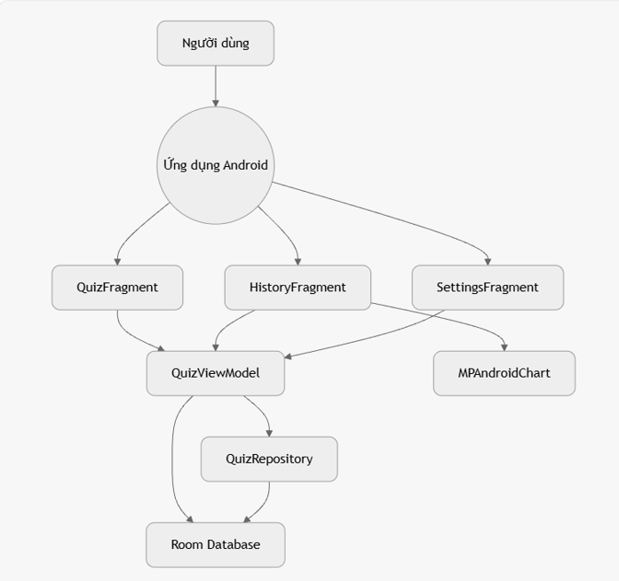
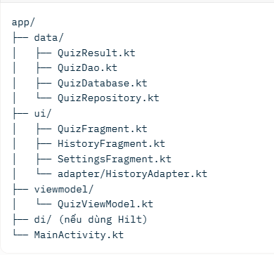
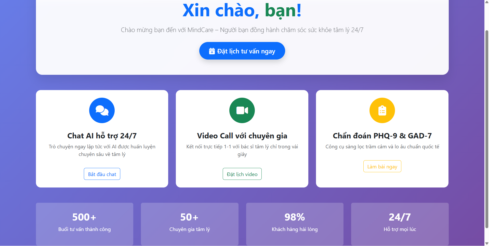
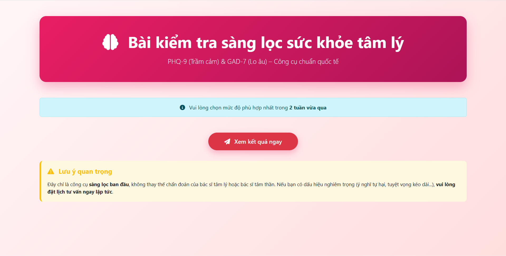
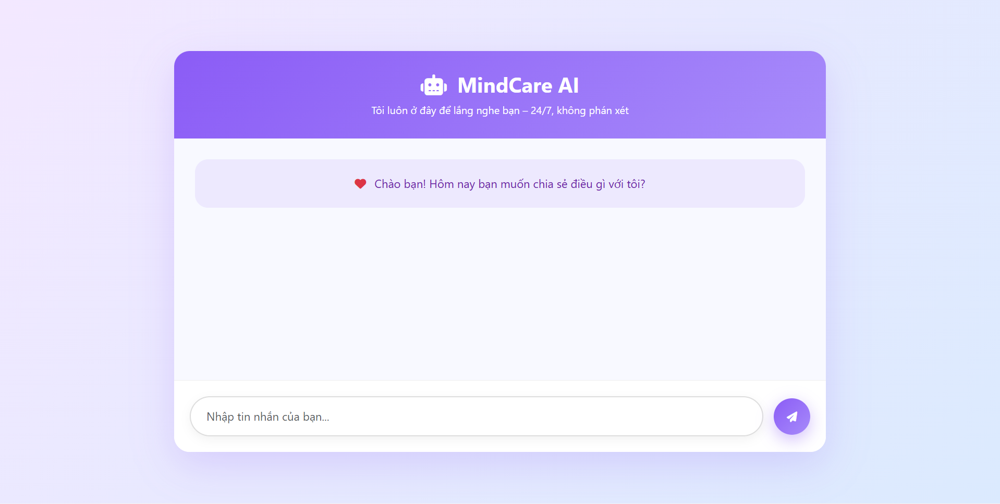
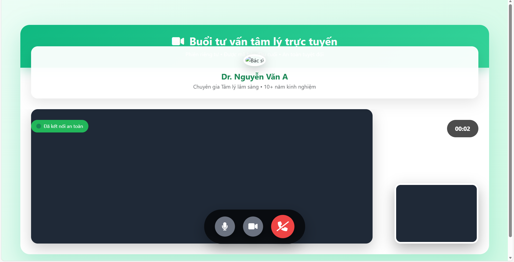

<h2 align="center">
    <a href="https://dainam.edu.vn/vi/khoa-cong-nghe-thong-tin">
    🎓 Faculty of Information Technology (DaiNam University)
    </a>
</h2>

<h2 align="center">
    CHUYỂN ĐỔI SỐ TRONG HỖ TRỢ CHẨN ĐOÁN SỨC KHỎE TÂM LÍ
</h2>

<div align="center">
    <p align="center">
        
        
        
    </p>

[](https://www.facebook.com/DNUAIoTLab)
[](https://dainam.edu.vn/vi/khoa-cong-nghe-thong-tin)
[](https://dainam.edu.vn)
</div>


Dự án ứng dụng Android được phát triển cho môn học **Chuyển đổi số**. 
Ứng dụng này là một công cụ giúp số hóa quy trình tự đánh giá và theo dõi sức khỏe tâm lý, dựa trên thang đo **PHQ-9 (Patient Health Questionnaire-9)** đã được khoa học công nhận.

---

## 📖 1. Giới thiệu hệ thống

**Ứng dụng Chuyển đổi số Hỗ trợ Chẩn đoán Sức khỏe Tâm lý** là một giải pháp công nghệ y tế (HealthTech) được phát triển nhằm số hóa quy trình sàng lọc và chăm sóc sức khỏe tinh thần. Thay vì sử dụng các bảng câu hỏi giấy truyền thống tốn kém và chủ quan, hệ thống cung cấp một công cụ tự động, riêng tư và khoa học ngay trên thiết bị di động.

### 💡 Tại sao cần ứng dụng này?
Trong bối cảnh áp lực cuộc sống hiện đại gia tăng, việc tiếp cận các dịch vụ tâm lý thường gặp rào cản về chi phí, thời gian và sự e ngại (stigma). Ứng dụng này giúp:
* **Sàng lọc sớm:** Tự nhận diện các dấu hiệu bất ổn như trầm cảm hoặc lo âu.
* **Xóa bỏ rào cản:** Người dùng có thể tự kiểm tra tại nhà, riêng tư và bảo mật.
* **Kết nối chuyên gia:** Cầu nối trực tiếp giữa bệnh nhân và bác sĩ tâm lý.

### 🛠️ Chức năng chính
| Thành phần | Chức năng chi tiết |
| :--- | :--- |
| **Chẩn đoán tự động** | - Tích hợp thang đo chuẩn y khoa **PHQ-9** (Trầm cảm) và **GAD-7** (Lo âu).<br>- Tự động tính điểm và phân loại mức độ rủi ro (Bình thường, Nhẹ, Nặng). |
| **Trợ lý ảo AI** | - Chatbot thông minh hoạt động 24/7.<br>- Hỗ trợ sơ cứu tâm lý ban đầu, lắng nghe và xoa dịu cảm xúc. |
| **Telemedicine** | - Đặt lịch khám trực tuyến.<br>- **Video Call 1-1** chất lượng cao với bác sĩ/chuyên gia tâm lý. |
| **Quản lý hồ sơ** | - Lưu trữ lịch sử khám bệnh cục bộ (Offline-first).<br>- Biểu đồ trực quan theo dõi biến động tâm lý theo thời gian. |

### 🔥 Điểm nổi bật
* ✅ **Khoa học:** Dựa trên các quy chuẩn y khoa quốc tế.
* ✅ **Bảo mật:** Dữ liệu nhạy cảm được mã hóa và ưu tiên lưu trữ trên thiết bị người dùng.
* ✅ **Hiện đại:** Giao diện Material Design 3 thân thiện, dễ sử dụng.

---

## 🔧 2. Công nghệ sử dụng

Dự án áp dụng các công nghệ và kiến trúc hiện đại nhất của lập trình Android (Native).

| Danh mục | Công nghệ / Thư viện |
| :--- | :--- |
| **Ngôn ngữ** | [](https://kotlinlang.org/) |
| **Kiến trúc** | **MVVM** (Model-View-ViewModel) |
| **Giao diện** | XML, Material Design 3, View Binding |
| **Cơ sở dữ liệu** | **Room Database** (Offline-first storage) |
| **Xử lý dữ liệu** | Coroutines, Flow, LiveData |
| **Biểu đồ** | MPAndroidChart |
| **Dependency Injection** | Hilt (Dagger) |

---

### 2.2. Sơ đồ kiến trúc (MVVM)
Ứng dụng tuân thủ nghiêm ngặt kiến trúc MVVM, phân tách rõ ràng các lớp (layer):



### 2.3. Cấu trúc thư mục
Cấu trúc thư mục được tổ chức theo từng lớp chức năng (layer) của MVVM:



---

 ## 🖼️ 3. Hình ảnh các chức năng

 ### 📱 Màn hình chính & Chẩn đoán
> Giao diện Dashboard trực quan và bài kiểm tra trắc nghiệm tâm lý.




### 🤖 Chat AI & Video Call
> Trò chuyện với trợ lý ảo và tư vấn trực tuyến với bác sĩ.



---

## 🚀 4. Các bước cài đặt

### 4.1. Yêu cầu hệ thống
* Android Studio Iguana (2023.2.1) hoặc mới hơn.
* Android SDK 34 (Android 14).
* Thiết bị Android hoặc máy ảo (Emulator) chạy Android 8.0 (Oreo) trở lên.

### 4.2. Các bước cài đặt
1.  **Clone Repository**
    ```bash
    git clone [https://github.com/](https://github.com/)[TÊN_GITHUB_CỦA_BẠN]/[TÊN_REPO_CỦA_BẠN].git
    ```

2.  **Mở dự án**
    * Mở **Android Studio**.
    * Chọn `File` > `Open` và trỏ đến thư mục dự án bạn vừa clone.

3.  **Đồng bộ hóa Gradle**
    * Đợi Android Studio tự động tải về và đồng bộ hóa các thư viện (dependencies) đã khai báo trong file `build.gradle.kts`.

4.  **Chạy ứng dụng**
    * Nhấn nút `Run 'app'` (biểu tượng ▶ màu xanh lá) và chọn thiết bị (máy ảo hoặc máy thật) để chạy.

---

## 👤 5. Liên hệ

Dự án được thực hiện bởi:

* **Đỗ Huy Dũng**
    * MSV: 1671020065
    * Email: 1671020065@dnu.edu.vn
* **Nguyễn Đức Tâm**
    * MSV: 1671020280
    * Email: 1671020280@dnu.edu.vn

**Trường Đại học Đại Nam - Khoa Công nghệ thông tin**
